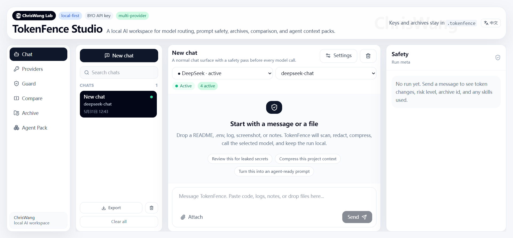
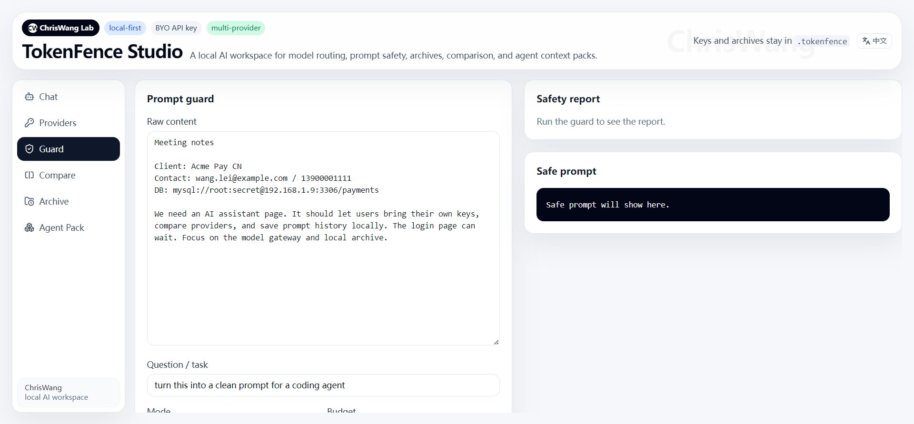

# TokenFence Studio

<p align="center">
  
</p>

<p align="center">
  <strong>Local-first AI Workspace & Intent Router for LLMs</strong>
</p>

<p align="center">
  Multi-model routing · Prompt safety · Context compression · Agent-ready workflows
</p>

<p align="center">
  <a href="./README.zh-CN.md">中文</a> ·
  <a href="mailto:your@email.com">Email</a>
</p>

---

## Overview

TokenFence Studio is a local-first AI workspace designed to sit between users and large language models.

Instead of sending raw prompts directly to an AI model, TokenFence analyzes intent, detects sensitive information, compresses context, and routes requests to the appropriate provider.

The goal is simple:

* Reduce unnecessary token usage
* Protect sensitive information
* Improve prompt quality
* Enable agent-ready workflows
* Keep user data local whenever possible

---

## Screenshot

### Chat Workspace



### Provider Management


### Prompt Guard



---

## Features

### Multi-Provider Support

Supports:

* OpenAI
* Anthropic Claude
* Gemini
* DeepSeek
* OpenRouter
* Ollama
* LM Studio

Bring your own API key.

No vendor lock-in.

---

### Prompt Guard

Detect and protect:

* API Keys
* Emails
* Phone numbers
* Database URLs
* Access tokens
* Chinese personal identifiers
* Common credential leaks

---

### Redaction Engine

Automatically replace sensitive information while preserving context.

Example:

[john@example.com](mailto:john@example.com)

↓

[EMAIL_1]

---

### Context Compression

Reduce prompt size while keeping user intent intact.

Designed for:

* GPT
* Claude
* Gemini
* DeepSeek
* Coding agents

---

### Intent Engine

Automatically classify requests.

Examples:

* Weather
* Coding
* Translation
* Resume
* Research
* Meeting Notes

Future versions will support custom skills and intent plugins.

---

### Local Archive

Store sanitized prompts locally.

No cloud storage required.

---

### Agent Context Packs

Generate reusable context bundles for:

* Claude Code
* Codex
* OpenClaw-style workflows
* MCP-based agents

---

## Architecture

```text
User
 │
 ▼
Intent Engine
 │
 ▼
Prompt Guard
 │
 ├── Scanner
 ├── Redactor
 ├── Risk Engine
 └── Compressor
 │
 ▼
Provider Router
 │
 ├── OpenAI
 ├── Claude
 ├── Gemini
 ├── DeepSeek
 ├── Ollama
 └── OpenRouter
 │
 ▼
Response
```

---

## Quick Start

```bash
git clone https://github.com/Chrisbetheking/tokenfence-studio.git

cd tokenfence-studio

npm install

npm run dev
```

Open:

```text
http://localhost:3000
```

---

## Project Structure

```text
src/
 ├── app/
 ├── components/
 ├── lib/
 │   ├── core/
 │   ├── providers/
 │   ├── skills/
 │   └── vault/
 └── api/

mcp/
cli/
docs/
examples/
```

---

## Roadmap

### Completed

* Multi-provider support
* Prompt guard
* Redaction engine
* Local archive
* Context compression
* Chat workspace

### Planned

* MCP Marketplace
* VSCode Extension
* Browser Extension
* Semantic Memory
* Local Vector Search
* Team Workspace
* Skill Marketplace
* Agent Orchestration

---

## Why TokenFence?

Most AI tools focus on model access.

TokenFence focuses on context quality.

Before a prompt reaches a model, TokenFence can:

* Understand intent
* Detect risk
* Remove sensitive data
* Compress context
* Route requests intelligently

The model becomes smarter because the input becomes better.

---

## Contributing

Issues and pull requests are welcome.

If you have ideas for new skills, providers, or agent workflows, feel free to contribute.

---

## Update Log

Recent updates and development notes are available in the [Update Log](./docs/changelog/README.md).

---

## Author

ChrisWang

Building practical AI infrastructure.

Made with coffee, curiosity, and too many late-night debugging sessions.

---

## License

MIT License
